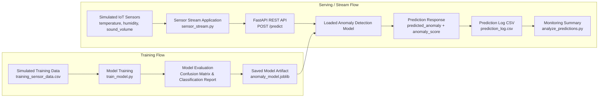

# System Architecture

This document describes the conceptual architecture of the anomaly detection system.

The architecture consists of two main flows:

- Training Flow
- Serving / Stream Flow

## Explanation

The training flow prepares the anomaly detection model. Simulated sensor data is generated and stored as a CSV file. The model training script trains an Isolation Forest model, evaluates it with basic metrics, and saves the trained model as a reusable model artifact.

The serving flow uses the saved model in a production-like setup. A simulated sensor stream continuously generates new measurements and sends them to a REST API. The API loads the saved model and returns a prediction response containing an anomaly flag and an anomaly score. Each prediction is logged to a CSV file and can be analyzed through a lightweight monitoring summary.